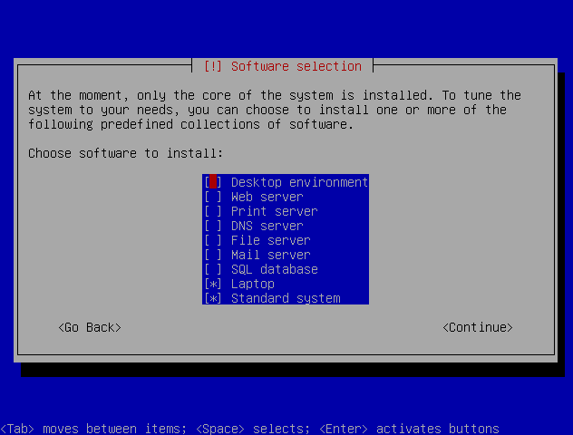

# install debian

I leaved the desktop environment option blank

but selected laptop option:
{}
wireless-tools
acpi-support
nvclock
cpufrequtils
hibernate
acpi
wpasupplicant
powertop
vbetool
pcmciautils
acpid
apmd
radeontool
toshset
anacron
avahi-autoipd
bluetooth
{}

I don't have bluetooth in my laptop, so lets purge it!

{}
# aptitude purge bluetooth
{}

# Basic installs

## Sudo command
{}# aptitude install sudo{}
add user to sudoers file
{}# adduser username sudo{}

2. Allow sudo for your normal user

Add your user to sudo group:

1
visudo
Add the following line (with your user name instead of ‘toub’):

1
toub ALL=(ALL:ALL) ALL

# Window manager

One of the reasons to install Ubuntu Server instead of Desktop is to avoid metapackages like ubuntu-desktop. Instead of strip down Ubuntu Desktop, It's much easier to install whatever you need from the server edition.

* xorg

* openbox

## Terminal

* terminator
* tint2
* kupfler

## Basic programs
*chromium
*music

### Sources
[https://help.ubuntu.com/community/ServerGUI](https://help.ubuntu.com/community/ServerGUI)
http://www.linuxjournal.com/content/slimline-debian-install-its-easier-you-might-think
http://benaiah41.wordpress.com/2008/08/15/37/
http://blog.toubiweb.com/debian-post-install/
